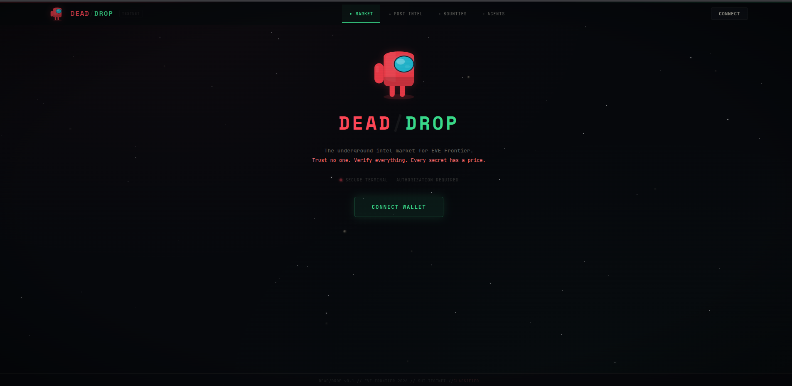
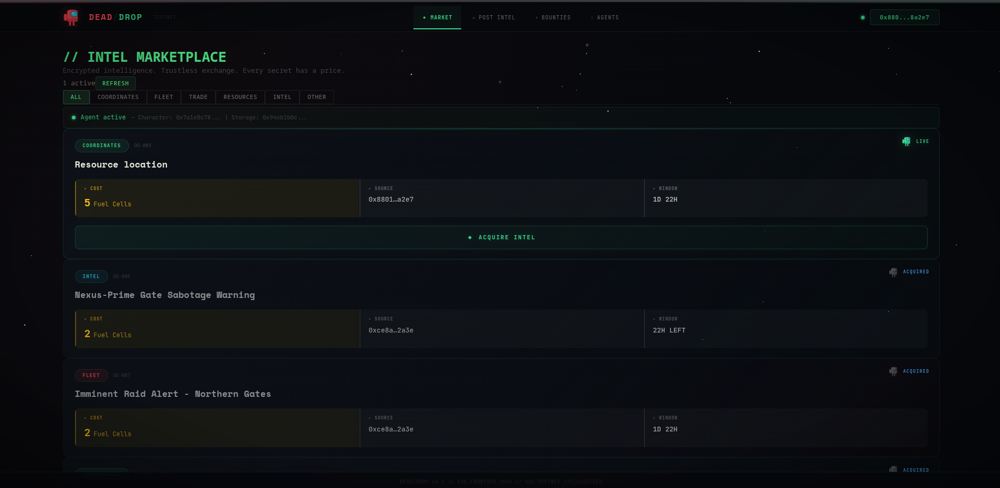
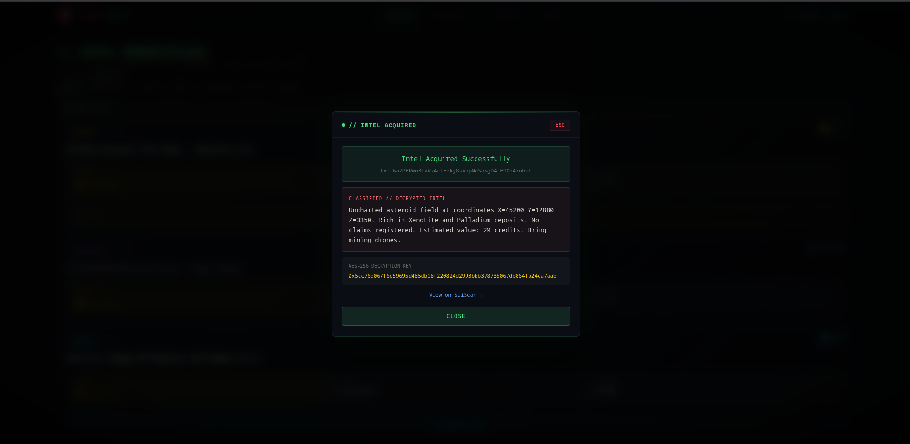
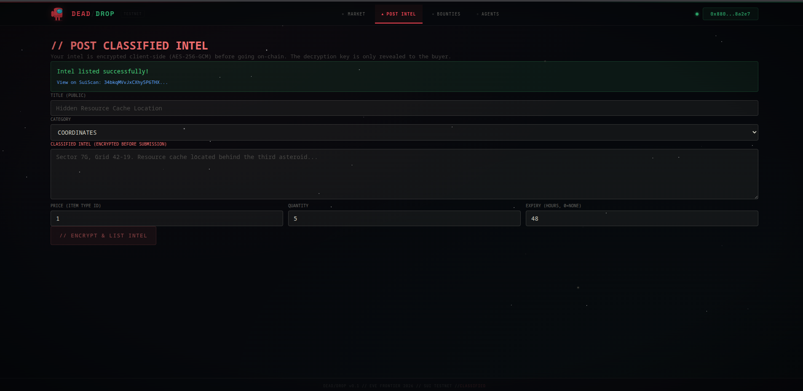
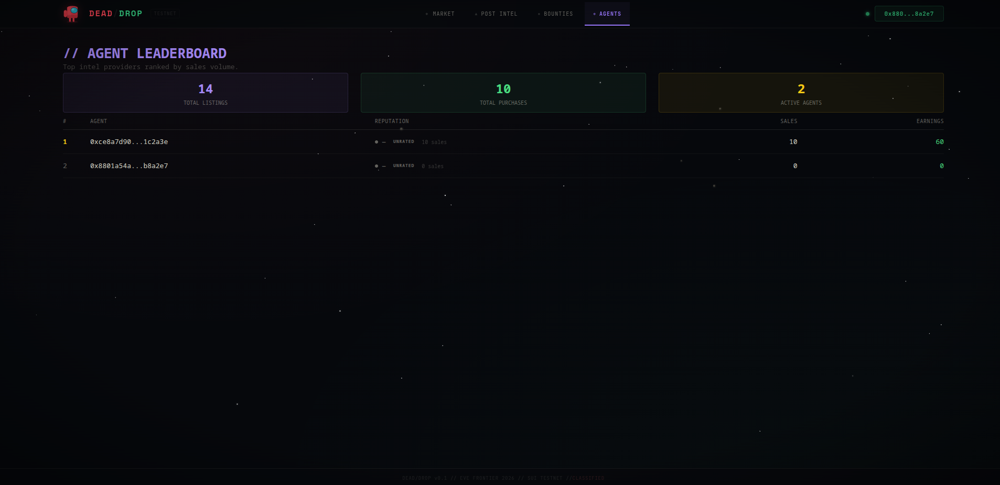

# DEAD/DROP

### Underground Intel Market for EVE Frontier

> *In a broken universe, the most valuable resource isn't fuel or minerals — it's information.*

Dead Drop turns Smart Storage Units into an underground intelligence network where scouts sell coordinates, spies trade fleet movements, and bounty hunters bid for target locations. Every transaction is trustless. Every provider is rated. Every secret has a price.

**[Live Demo](https://deaddrop-intel.vercel.app)** &nbsp;·&nbsp; **[Testnet Package](https://suiscan.xyz/testnet/object/0x01e770318f1fe9a184b976532b784367531d5404aaa8f6f4b19e96da65adbf42)**



## How It Works

### Selling Intel

1. Write classified intel — coordinates, fleet routes, trade secrets
2. Intel is **encrypted client-side** with AES-256-GCM before touching the blockchain
3. Encrypted payload + decryption key stored on-chain via Smart Storage Unit extension
4. Listing appears on the marketplace with title, category, and price

### Buying Intel

1. Browse the marketplace, pick a listing
2. Sign a wallet transaction that pays the listed item price
3. The Move smart contract atomically transfers payment and emits an `IntelPurchased` event
4. The event contains the **AES decryption key** — only visible to the buyer
5. The dApp decrypts and displays the secret intel instantly

### Reputation System

- Buyers rate intel accuracy within a 24-hour window
- Provider reputation is tracked on-chain and visible to all
- Low accuracy providers get flagged



## Features

| Feature | Description |
|---|---|
| **Intel Marketplace** | Browse, filter, and purchase encrypted intelligence |
| **Post Intel** | Encrypt and list your own intel for sale |
| **Bounty Board** | Post bounties requesting specific intel, claim with submissions |
| **Agent Leaderboard** | On-chain reputation scores, sales stats, trust ratings |
| **Auto Onboarding** | One-click demo account setup — character, storage, items, gas |
| **AES-256-GCM Encryption** | Client-side encryption — keys never exposed until purchase |



## Architecture

```
┌──────────────┐     AES-256-GCM       ┌───────────────────────┐
│   Provider   │ ──── encrypt ────────► │    Sui Blockchain     │
│   (dApp)     │                        │    IntelRegistry       │
└──────────────┘                        │    ├── listings[]      │
                                        │    ├── reputations     │
┌──────────────┐     purchase_intel     │    └── stats           │
│   Buyer      │ ──── sign tx ────────► │    BountyBoard         │
│   (wallet)   │ ◄── event: key ─────── │    ├── bounties[]      │
│              │     decrypt intel      │    └── claims          │
└──────────────┘                        └───────────────────────┘
```

### Move Smart Contracts

| Module | Purpose |
|---|---|
| `config.move` | Shared config, AdminCap, DeadDropAuth witness for Storage Unit extension |
| `intel_market.move` | Listings, purchases, ratings, on-chain reputation — 13 functions, 4 events |
| `bounty_board.move` | Bounty posting, claiming, accept/reject flow — 7 functions, 5 events |

### Tech Stack

| Layer | Technology |
|---|---|
| **Blockchain** | Sui (Move language) |
| **Extension Pattern** | Typed witness auth on Smart Storage Units |
| **Encryption** | AES-256-GCM via Web Crypto API (client-side) |
| **Frontend** | React + Vite + EVE Frontier dApp Kit |
| **Wallet** | Slush (Sui wallet) |
| **Deployment** | Vercel (frontend + API) · Sui Testnet (contracts) |
| **Onboarding** | Serverless API — auto-provisions character, NWN, storage, items |



## Quick Start

### For Users

1. Visit **[deaddrop-intel.vercel.app](https://deaddrop-intel.vercel.app)**
2. Connect your Slush wallet (Sui testnet)
3. Click **"Setup Demo Account"** — creates your character, storage, and items automatically
4. Browse intel, post intel, purchase secrets

### For Developers

```bash
git clone https://github.com/Ni8crawler18/dead-drop.git
cd dead-drop
pnpm install

# Deploy contracts (requires Sui CLI + testnet SUI)
cd move-contracts/dead_drop
sui client publish -e testnet --with-unpublished-dependencies

# Configure
cp .env.example .env
# Fill in contract addresses from publish output

# Run dApp
cd dapps && pnpm install && pnpm dev
```

### Available Scripts

| Script | Description |
|---|---|
| `pnpm dd:configure-market` | Set rating window and listing limits |
| `pnpm dd:create-listing` | Encrypt and list intel for sale |
| `pnpm dd:purchase-intel` | Buy intel, receive decryption key |
| `pnpm dd:rate-intel` | Rate purchased intel accuracy |
| `pnpm dd:post-bounty` | Post a bounty requesting specific intel |
| `pnpm dd:submit-claim` | Submit intel to claim a bounty |
| `pnpm dd:accept-claim` | Accept a bounty claim (poster only) |



## Security

| Measure | Detail |
|---|---|
| **Client-side encryption** | AES-256-GCM — intel encrypted before going on-chain |
| **Key reveal via events** | Decryption key only exposed in the `IntelPurchased` transaction event |
| **Typed witness pattern** | `DeadDropAuth` restricts who can interact with storage units |
| **Self-purchase prevention** | Smart contract blocks buying your own listings |
| **Rating window** | Buyers must rate within 24 hours of purchase |
| **Immutable reputation** | On-chain ratings are transparent and permanent |
| **Rate-limited onboarding** | 1 request per minute per wallet to prevent abuse |
| **CORS restricted API** | Onboarding endpoint only accepts requests from the dApp domain |

## License

MIT
